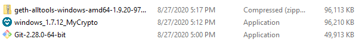
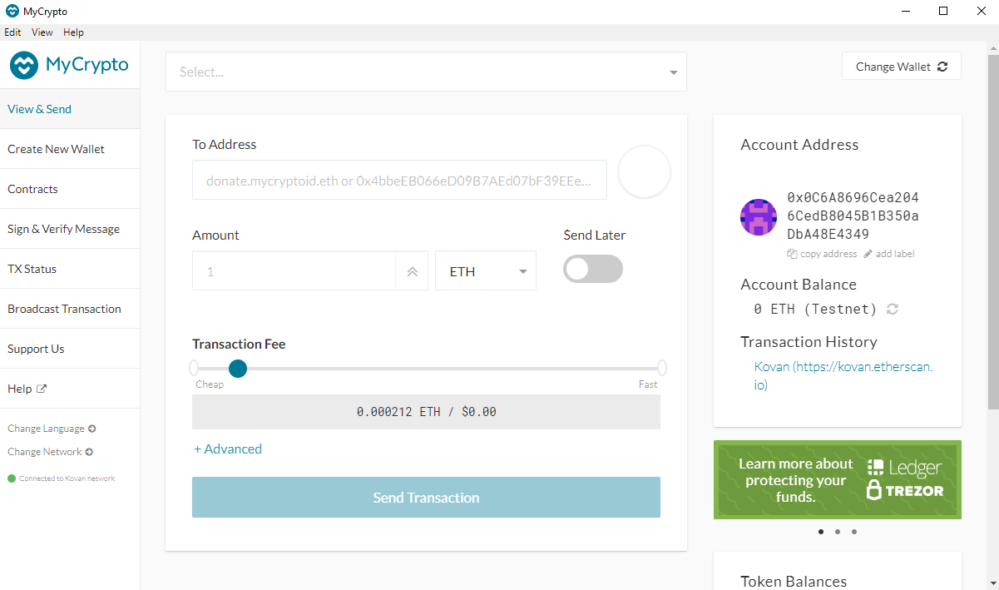
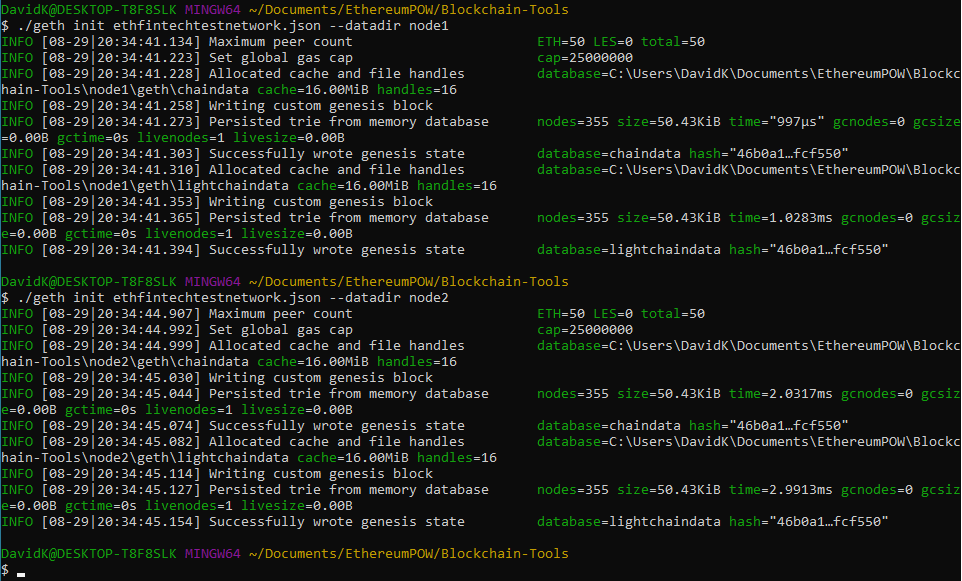

Windows instructions for creating an Ethereum blockchain.
## Setup Instructions
You will need the following programs to set up the Ethereum Blockchain:
* [Git Bash](https://git-scm.com/downloads)
* [MyCrypto](https://download.mycrypto.com/)
* [Go Ethereum](https://geth.ethereum.org/downloads/) ('Geth')

### Go Ethereum Special Instructions
When downloading Geth make sure to select the latest version of "Geth & Tools."

After downloading Geth & Tools extract the files to folder you wish to save your blockcahin files.

As a final step, rename the extracted folder to Blockchain-Tools.

## Create a MyCrypto Wallet Account

Click the triangle to expand instructions

* Create accounts for two (or more) nodes for the network with a separate `datadir` for each using `geth`. Open the MyCrypto app. Select 'Create New Wallet' and then select 'Generate a Wallet' under the Create New Wallet box.

    

* On the next screen select 'Generate a Mnemonic Phrase.'
    

* The following screen will provide a 12-word private seed phrase. This 12-word phrase should be written down in its exact order and stored safely.

* Next you will be prompted to confirm the mnemonic phrase from the previous screen by selecting the words in the order in which they were provided.

* After confirming your mnemonic phrase you will now be able to log into your wallet using that phrase. On the "How would you like to access your wallet?" menu select Mnemonic Phrase in the bottom right corner.
    

* Enter your 12-word mnemonic phrase with spaces to unlock the wallet and move on to selecting an address that is derived from your mnemonic phrase.

    

* The Addresses should be pointing to Testnet (ETH). There is a list of addresses derived from the mnemonic phrase to be selected from. The balance for each address is to the right of each address. Select one and click 'Unlock'.
    

* On the right hand side the Account Address is visible with a 'copy address' button below it. Click 'copy address' and save this for later steps. It is important to use this 'copy address' button to eliminate the risk of copy errors and capture the capitalized letters. Note: The 'To Address' on the center of this screen does not capitalize letter and is not your valid address.
    

* The second important piece of information to copy and store safely is the private key for this address. Click the top center dropdown menu and select 'Wallet Info.' To see the private key click the eye icon to the right of Private Key (unencrypted).
    
    

## Create a blockchain with 'Geth' (Go Ethereum)
Generate the genesis block configurations with geth.
* Open Git Bash and change directories `cd Documents/EthereumPOW/Blockchain-Tools` to the Blockchain-Tools folder.

    

* Run `./puppeth` and name your network.

* Select the option to `configure a new genesis block`. Next select `create new genesis from scratch`.

* Choose the `Ethash (Proof of Work)` consensus algorithm.

* Paste the account address(es) from the MyCrypto steps into the list of accounts to seal.

* Press `enter` enter when prompted for pre-funding the pre-compiled accounts with wei.

* Set a numeric network ID (`829` was used in this example). 

    

* Now that you are back at the main menu, choose the `Manage existing genesis` option.

* Select `Export genesis configurations`. Hit enter and the files will be saved to the current directory 'Blockchain-Tools'. This will fail to create two of the files, but you only need json file with your network name (`fintechtestnetwork.json` in this example). Press `ctrl+C` to exit the puppeth prompts.

    

* Note: The json files created in the previous step can be seen in the windows explorer 'Blockcahin-Tools' folder.

    

Initialize each node with the new `networkname.json` with `geth`.

* Create accounts for two (or more) nodes for the network with a separate `datadir` for each using `geth`. Replace nodename with your node's name e.g. node1.

    `./geth account new --datadir nodename`

    Saving the 'Public address of the key' and 'Path of the secret key file' will allow you to restart the blockchain after closing.

    

* Initiate the nodes to follow the protocol set in the genesis block file `fintechtestnetwork.json`.

    `./geth init fintechtestnetwork.json --datadir node1`

    `./geth init fintechtestnetwork.json --datadir node2`

    

* Start mining with the first node. Make sure to capture the enode address. This will be used for the next step.

    `./geth --datadir node1 --mine --minerthreads 1`

    

* Start the second node using the first node's `enode` address as the `bootnode` flag.

    `./geth --datadir node2 --port 30304 --rpc --bootnodes "enode://8a6db19a11d54903de1b501743a1e19250abd753c209b36a44f92590a670c5a99daeb21dc6f2e42d3be085c6aea3557332c6ece3dbc1d66611469729a75c7c0b@127.0.0.1:30303" --ipcdisable`

    

## Send a test transaction
* Return the the MyCrpto app. On the lefthand-side click `Change Network` and the click `+Add Custom Node`.

* Enter the Node Name and Network Name. Set Network to Custom and Currency as ETH. The Network ID should be entered as the Chain ID. Use `http://127.0.0.1:8545` as the the URL. Click 'Save & Use Custom Node.'
    

* After saving the Custom Node, change the network on the left-hand side of the MyCrypto app to `ethfintechtestnetwork`.
    

* Logging back into your wallet you will see a new account balance! Proceed with copying and pasting your Account Address into the To Address. This is to send a test transaction. Pick any amount and to prioritize the processing of this transaction set the Transaction Fee to the maximum amount. Click Send Transaction. A popup will prompt you to confirm sending the transaction. Click 'Send'.
    
* A green bar will pop up at the bottom of the app. In the screenshot below you can also see on the Git Bash window of node 2 that the transacion was submitted and the transaction hash. Click "TX Status" in the popup to see details of the transaction status.
    

* The transaction status screen provides details including Status, TX Hash, From Address, To Address, Amount, Gas Price, and Gas Limit.
    

* Click 'Check TX Status' to refresh. The status will say SUCCESSFUL when the complete. Additional details are added included Gas Used, and the Transaction Fee. Creating a blockchain and send a test transaction is now complete!
    